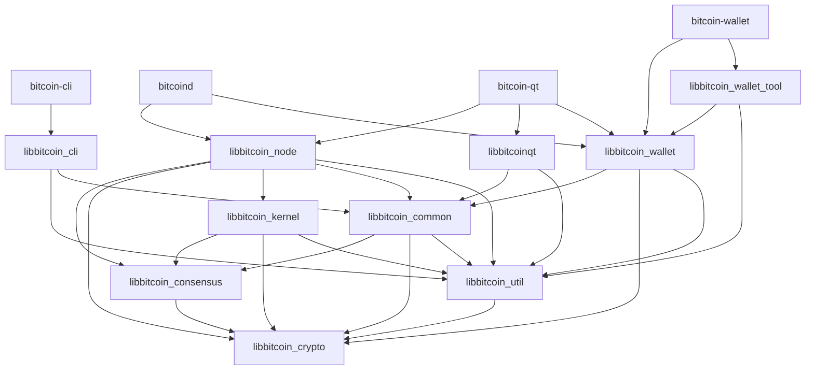

# Bitcoin Core - Complete Developer Documentation

## Table of Contents
1. [Introduction](#introduction)
2. [Architecture Overview](#architecture-overview)
3. [Core Components](#core-components)
4. [Library Structure](#library-structure)
5. [Build System](#build-system)
6. [Network Layer](#network-layer)
7. [Consensus Layer](#consensus-layer)
8. [Validation and Blockchain](#validation-and-blockchain)
9. [Transaction Mempool](#transaction-mempool)
10. [Wallet System](#wallet-system)
11. [RPC/API Interfaces](#rpcapi-interfaces)
12. [Script System](#script-system)
13. [Cryptography](#cryptography)
14. [Index Subsystem](#index-subsystem)
15. [GUI Components](#gui-components)
16. [IPC and Multiprocess](#ipc-and-multiprocess)
17. [Testing Infrastructure](#testing-infrastructure)
18. [Development Workflow](#development-workflow)
19. [Contributing Guidelines](#contributing-guidelines)

---

## Introduction

Bitcoin Core is the reference implementation of the Bitcoin protocol. It serves as a full node that:
- Downloads and validates the entire blockchain
- Relays transactions and blocks to the network
- Provides wallet functionality
- Offers RPC interfaces for external applications
- Includes a graphical user interface (optional)

### Project Structure
```
bitcoi/
├── src/              # Core source code
├── doc/              # Documentation
├── test/             # Test suites
├── contrib/          # Utility scripts and tools
├── depends/          # Dependency management
├── share/            # Platform-specific files
├── ci/               # Continuous integration scripts
└── cmake/            # CMake build system files
```

### Key Executables
- **bitcoin** - Wrapper command supporting subcommands (gui, node, rpc, wallet, tx)
- **bitcoind** - Bitcoin daemon (headless node)
- **bitcoin-qt** - Bitcoin GUI client
- **bitcoin-cli** - RPC command-line client
- **bitcoin-wallet** - Wallet management tool
- **bitcoin-tx** - Transaction manipulation utility
- **bitcoin-util** - General utility tool
- **bitcoin-chainstate** - Chainstate utility

---

## Architecture Overview

Bitcoin Core follows a modular architecture with clear separation of concerns:

```
┌─────────────────────────────────────────────────────────────┐
│                     Application Layer                        │
│  ┌──────────────┐  ┌──────────────┐  ┌──────────────┐      │
│  │ bitcoin-qt   │  │  bitcoind    │  │ bitcoin-cli  │      │
│  │    (GUI)     │  │   (Daemon)   │  │    (RPC)     │      │
│  └──────────────┘  └──────────────┘  └──────────────┘      │
└─────────────────────────────────────────────────────────────┘
                            │
┌─────────────────────────────────────────────────────────────┐
│                    Interface Layer                           │
│  ┌────────────┐  ┌────────────┐  ┌────────────┐            │
│  │   Chain    │  │    Node    │  │   Wallet   │            │
│  │ Interface  │  │ Interface  │  │ Interface  │            │
│  └────────────┘  └────────────┘  └────────────┘            │
└─────────────────────────────────────────────────────────────┘
                            │
┌─────────────────────────────────────────────────────────────┐
│                      Core Layer                              │
│  ┌────────────┐  ┌────────────┐  ┌────────────┐            │
│  │   Node     │  │   Wallet   │  │    RPC     │            │
│  │  (P2P +    │  │  (Key Mgmt │  │  (Server)  │            │
│  │   Server)  │  │  + Coins)  │  │            │            │
│  └────────────┘  └────────────┘  └────────────┘            │
└─────────────────────────────────────────────────────────────┘
                            │
┌─────────────────────────────────────────────────────────────┐
│                   Consensus Layer                            │
│  ┌────────────┐  ┌────────────┐  ┌────────────┐            │
│  │   Kernel   │  │ Validation │  │   Script   │            │
│  │ (Consensus │  │  (Chain    │  │ Interpreter│            │
│  │   Engine)  │  │   State)   │  │            │            │
│  └────────────┘  └────────────┘  └────────────┘            │
└─────────────────────────────────────────────────────────────┘
                            │
┌─────────────────────────────────────────────────────────────┐
│                  Foundation Layer                            │
│  ┌────────────┐  ┌────────────┐  ┌────────────┐            │
│  │   Crypto   │  │    Util    │  │  Common    │            │
│  │ (Hashing,  │  │ (Helpers,  │  │ (Shared    │            │
│  │   Signing) │  │   Logging) │  │   Code)    │            │
│  └────────────┘  └────────────┘  └────────────┘            │
└─────────────────────────────────────────────────────────────┘
```

---

## Core Components

### 1. Node Component (`src/node/`)
The node component manages the full node functionality:
- **Block Storage** - Manages block data on disk
- **Chain State** - Maintains UTXO set and chain state
- **Mempool Management** - Unconfirmed transaction pool
- **P2P Connection Management** - Peer discovery and connections

Key Files:
- `src/node/blockstorage.cpp` - Block storage and retrieval
- `src/node/chainstate.cpp` - Chain state management
- `src/node/miner.cpp` - Block template creation
- `src/node/utxo_snapshot.cpp` - AssumeUTXO support

### 2. Network Layer (`src/net*.cpp`)
Handles all P2P networking:
- **Connection Management** (`src/net.cpp`) - TCP connections, peer lifecycle
- **Message Processing** (`src/net_processing.cpp`) - Protocol message handling
- **Address Management** (`src/addrman.cpp`) - Peer address database
- **Network Types** - Support for IPv4, IPv6, Tor, I2P, CJDNS

Network Features:
- Peer discovery via DNS seeds
- Peer-to-peer message protocol
- Block and transaction relay
- Bloom filters for SPV clients
- Compact block relay (BIP 152)
- BIP 324 V2 P2P transport encryption

### 3. Consensus Layer (`src/consensus/`)
Contains consensus-critical code:
- **Validation Rules** (`consensus/validation.h`) - Block/tx validation
- **Merkle Tree** (`consensus/merkle.cpp`) - Merkle root calculation
- **Transaction Verification** (`consensus/tx_verify.cpp`) - Signature checks
- **Consensus Parameters** (`consensus/params.h`) - Network parameters

### 4. Script System (`src/script/`)
Bitcoin's scripting language implementation:
- **Interpreter** (`script/interpreter.cpp`) - Script execution engine
- **Descriptors** (`script/descriptor.cpp`) - Output descriptor language
- **Miniscript** (`script/miniscript.h`) - Structured scripting
- **Signing** (`script/sign.cpp`) - Transaction signing

Script Types:
- P2PKH (Pay to Public Key Hash)
- P2SH (Pay to Script Hash)
- P2WPKH (Pay to Witness Public Key Hash)
- P2WSH (Pay to Witness Script Hash)
- P2TR (Pay to Taproot)

### 5. Wallet System (`src/wallet/`)
Complete wallet functionality:
- **Key Management** (`wallet/scriptpubkeyman.cpp`) - Private key storage
- **Coin Selection** (`wallet/coinselection.cpp`) - UTXO selection algorithms
- **Transaction Building** (`wallet/spend.cpp`) - Transaction creation
- **Database** (`wallet/walletdb.cpp`) - Wallet persistence

Wallet Features:
- HD (Hierarchical Deterministic) wallets (BIP 32)
- Mnemonic seeds (BIP 39)
- Multi-signature wallets
- Hardware wallet support (HWI)
- Watch-only addresses
- Descriptor wallets
- Encrypted wallets

### 6. Validation Engine (`src/validation.cpp`)
Core validation logic:
- Block validation and connection
- Transaction validation
- UTXO set management
- Reorganization handling
- Fee estimation
- Difficulty adjustment

### 7. Transaction Mempool (`src/txmempool.cpp`)
Unconfirmed transaction pool:
- Transaction prioritization
- Fee rate tracking
- Ancestor/descendant limits
- Replace-by-fee (RBF) support
- Package relay support
- Mempool persistence

### 8. RPC Interface (`src/rpc/`)
JSON-RPC API for external applications:
- **Blockchain RPCs** (`rpc/blockchain.cpp`) - Chain queries
- **Network RPCs** (`rpc/net.cpp`) - Network information
- **Wallet RPCs** (`rpc/wallet/*.cpp`) - Wallet operations
- **Mining RPCs** (`rpc/mining.cpp`) - Mining operations
- **Raw Transaction RPCs** (`rpc/rawtransaction.cpp`) - Transaction construction

### 9. Index Subsystem (`src/index/`)
Optional blockchain indices:
- **Transaction Index** (`index/txindex.cpp`) - Lookup any transaction
- **Block Filter Index** (`index/blockfilterindex.cpp`) - Compact block filters
- **Coin Stats Index** (`index/coinstatsindex.cpp`) - UTXO statistics

### 10. Kernel (`src/kernel/`)
Isolated consensus engine:
- Consensus validation
- Chain parameters
- Block management
- Mempool functionality
- No external dependencies on node/wallet/GUI

---

## Library Structure

Bitcoin Core is organized into several libraries with clear dependency rules:

### Library Dependency Graph



### Library Descriptions

| Library | Description | Location |
|---------|-------------|----------|
| **libbitcoin_cli** | RPC client functionality for bitcoin-cli | Common |
| **libbitcoin_common** | Shared high-level functionality | `src/` (various) |
| **libbitcoin_consensus** | Consensus-critical validation | `src/consensus/` |
| **libbitcoin_crypto** | Cryptographic primitives | `src/crypto/` |
| **libbitcoin_kernel** | Consensus engine (libbitcoinkernel) | `src/kernel/` |
| **libbitcoinqt** | GUI implementation | `src/qt/` |
| **libbitcoin_node** | P2P and RPC server functionality | `src/node/` |
| **libbitcoin_util** | Low-level utilities | `src/util/` |
| **libbitcoin_wallet** | Wallet functionality | `src/wallet/` |
| **libbitcoin_wallet_tool** | Wallet tool utilities | `src/wallet/` |
| **libbitcoin_zmq** | ZeroMQ notification interface | `src/zmq/` |

### Dependency Rules

1. **libbitcoin_crypto** - Standalone, no dependencies on other Bitcoin libraries
2. **libbitcoin_util** - Only depends on crypto, provides utilities for all
3. **libbitcoin_consensus** - Only depends on crypto, used by all
4. **libbitcoin_kernel** - Only depends on consensus, crypto, util
5. **libbitcoin_node** - Only library that should depend on kernel
6. **GUI/Wallet/Node** - Independent, communicate via `src/interfaces/`

---

## Build System

Bitcoin Core uses **CMake** as its primary build system.

### Build Process Overview

```bash
# Configure build
cmake -B build -DCMAKE_BUILD_TYPE=Release

# Build all targets
cmake --build build -j$(nproc)

# Run tests
ctest --test-dir build
```

### CMake Build Options

| Option | Description | Default |
|--------|-------------|---------|
| `BUILD_BITCOIN_BIN` | Build bitcoin wrapper executable | ON |
| `BUILD_DAEMON` | Build bitcoind executable | ON |
| `BUILD_GUI` | Build bitcoin-qt GUI | OFF |
| `BUILD_CLI` | Build bitcoin-cli | ON |
| `BUILD_WALLET` | Build wallet support | ON |
| `BUILD_WALLET_TOOL` | Build bitcoin-wallet | ON |
| `BUILD_TX` | Build bitcoin-tx | ON |
| `BUILD_UTIL` | Build bitcoin-util | ON |
| `BUILD_TESTS` | Build test suite | ON |
| `BUILD_BENCH` | Build benchmarks | ON |
| `ENABLE_WALLET` | Enable wallet functionality | ON |
| `WITH_ZMQ` | Enable ZMQ notifications | ON |
| `WITH_USDT` | Enable USDT tracepoints | OFF |

### Dependencies

Core dependencies (see `doc/dependencies.md`):
- **Boost** - Various utilities and data structures
- **libevent** - Asynchronous event notification
- **SQLite** - Wallet database (descriptor wallets)
- **Berkeley DB** - Legacy wallet database
- **Qt 6** - GUI framework (optional)
- **ZeroMQ** - Message notifications (optional)
- **MiniUPnPc** - UPnP port mapping (optional)
- **libnatpmp** - NAT-PMP port mapping (optional)

Embedded libraries:
- **LevelDB** - Blockchain database
- **secp256k1** - ECDSA cryptography
- **univalue** - JSON parsing
- **minisketch** - Erlay set reconciliation

### Platform-Specific Builds

See detailed build documentation:
- [Unix/Linux Build](doc/build-unix.md)
- [macOS Build](doc/build-osx.md)
- [Windows (MSVC) Build](doc/build-windows-msvc.md)
- [FreeBSD Build](doc/build-freebsd.md)
- [OpenBSD Build](doc/build-openbsd.md)
- [NetBSD Build](doc/build-netbsd.md)

---

## Network Layer

### P2P Protocol

Bitcoin Core implements the Bitcoin P2P protocol for:
- Peer discovery
- Block propagation
- Transaction relay
- Address sharing

### Network Components

#### 1. Connection Management (`src/net.cpp`)
- **CConnman** - Main connection manager class
- Socket handling (IPv4, IPv6, Tor, I2P, CJDNS)
- Connection limits and eviction
- Bandwidth management
- Message serialization/deserialization

#### 2. Message Processing (`src/net_processing.cpp`)
Handles protocol messages:
- **version/verack** - Handshake
- **ping/pong** - Keep-alive
- **getdata/block/tx** - Data retrieval
- **inv** - Inventory announcements
- **headers** - Header synchronization
- **getblocks/getheaders** - Chain synchronization
- **mempool** - Mempool query
- **addr/getaddr** - Address sharing

#### 3. Address Manager (`src/addrman.cpp`)
- Peer address database
- Address bucketing and selection
- Connection prioritization
- Prevents Sybil attacks

#### 4. Ban Manager (`src/banman.cpp`)
- Peer misbehavior tracking
- Automatic banning
- Manual ban management

### Network Protocols

#### Standard P2P
Default TCP-based P2P connections on port 8333 (mainnet).

#### Tor Support (`doc/tor.md`)
- Connect through Tor SOCKS proxy
- Hidden service operation
- Automatic .onion address creation

#### I2P Support (`doc/i2p.md`)
- Anonymous I2P network support
- SAM protocol implementation

#### CJDNS Support (`doc/cjdns.md`)
- IPv6-based mesh network

#### BIP 324 - V2 Transport
- Encrypted P2P connections
- Authentication
- Better privacy and security

### Block Propagation

#### Compact Blocks (BIP 152)
- Reduced bandwidth usage
- Faster block relay
- High-bandwidth mode for faster relays

#### Headers-First Synchronization
- Download headers first
- Validate and download blocks in parallel
- Faster initial sync

---

## Consensus Layer

The consensus layer enforces Bitcoin's protocol rules.

### Block Validation

#### Block Structure (`src/primitives/block.h`)
```cpp
class CBlock {
    CBlockHeader header;     // 80-byte header
    std::vector<CTransactionRef> vtx;  // Transactions
};

class CBlockHeader {
    int32_t nVersion;
    uint256 hashPrevBlock;
    uint256 hashMerkleRoot;
    uint32_t nTime;
    uint32_t nBits;
    uint32_t nNonce;
};
```

#### Validation Rules
1. Block header validation
2. Proof-of-work check
3. Merkle root verification
4. Transaction validation
5. UTXO updates
6. Block weight/size limits
7. Coinbase maturity
8. Time-based rules

### Transaction Validation

#### Transaction Structure (`src/primitives/transaction.h`)
```cpp
class CTransaction {
    int32_t nVersion;
    std::vector<CTxIn> vin;   // Inputs
    std::vector<CTxOut> vout; // Outputs
    uint32_t nLockTime;
    // Witness data for SegWit
};
```

#### Validation Checks (`src/consensus/tx_check.cpp`)
- Input/output structure
- No duplicate inputs
- Valid amounts
- Size limits
- Script validation

#### Signature Verification (`src/consensus/tx_verify.cpp`)
- ECDSA signature verification
- Schnorr signature verification (Taproot)
- Script execution
- Witness validation

### Consensus Parameters (`src/kernel/chainparams.cpp`)

Different networks with different parameters:
- **Mainnet** - Production Bitcoin network
- **Testnet** - Public testing network
- **Signet** - Controlled testing network
- **Regtest** - Local regression testing

Parameters include:
- Genesis block
- Proof-of-work limit
- Block time target
- Subsidy halving interval
- Soft fork activation heights

### Soft Fork Deployments

#### BIP 9 - Version Bits
Miner signaling for soft fork activation.

#### BIP 341/342 - Taproot
- Schnorr signatures
- MAST (Merkelized Alternative Script Trees)
- Improved privacy and efficiency

#### SegWit (BIP 141/143/144)
- Transaction malleability fix
- Block weight instead of size
- Witness commitment

---

## Validation and Blockchain

### Chain State Management

#### CChainState (`src/validation.h`)
Manages the active blockchain:
- UTXO set
- Block index
- Chain tips
- Reorganizations

#### UTXO Set (`src/coins.cpp`)
- **CCoinsView** - Abstract UTXO view
- **CCoinsViewCache** - In-memory cache
- **CCoinsViewDB** - Persistent database

#### Block Index (`src/chain.h`)
- **CBlockIndex** - Block metadata
- **CChain** - Active chain
- Block tree management

### Validation Interface (`src/validationinterface.cpp`)

Event notification system:
- New block connected
- Block disconnected
- Transaction added to mempool
- Transaction removed from mempool

Subscribers:
- Wallet
- ZMQ publisher
- Indices

### AssumeUTXO (`doc/assumeutxo.md`)

Fast initial sync by loading UTXO snapshot:
- Download and validate UTXO snapshot
- Start using Bitcoin immediately
- Background validation of history

### Reorg Handling

When a competing chain becomes longer:
1. Disconnect blocks from old tip
2. Connect blocks from new tip
3. Update UTXO set
4. Notify subscribers

---

## Transaction Mempool

The mempool (`src/txmempool.cpp`) stores unconfirmed transactions.

### Mempool Features

#### Transaction Storage
- **CTxMemPool** - Main mempool class
- **CTxMemPoolEntry** - Single transaction entry
- Fee tracking
- Ancestor/descendant tracking

#### Fee Estimation (`src/policy/fees/`)
- Dynamic fee estimation
- Historical confirmation data
- Fee rate recommendations

#### Transaction Prioritization
- By fee rate (sat/vB)
- Ancestor package fee rate
- CPFP (Child Pays For Parent)

#### Policy Rules (`src/policy/`)
- Minimum fee rate
- Dust threshold
- Standard transaction types
- Script verification flags

#### Replace-By-Fee (RBF) (`src/policy/rbf.cpp`)
- BIP 125 signaling
- Fee increase requirements
- Conflict resolution

#### Package Relay (`src/policy/packages.cpp`)
- Package validation
- CPFP optimization
- Package limits

### Mempool Limits

- Maximum size (default 300 MB)
- Maximum ancestor count (25)
- Maximum descendant count (25)
- Minimum relay fee rate
- Eviction by fee rate when full

---

## Wallet System

### Wallet Architecture

The wallet system (`src/wallet/`) provides:
- Private key management
- Address generation
- Transaction creation
- Balance tracking
- Coin selection

### Wallet Types

#### Legacy Wallets
- Berkeley DB backend
- Traditional key storage
- Being phased out

#### Descriptor Wallets (Recommended)
- SQLite backend
- Output descriptor-based
- Better backup and recovery
- Hardware wallet support

### Key Management (`src/wallet/scriptpubkeyman.cpp`)

#### LegacyScriptPubKeyMan
- Traditional keypool
- Key derivation
- HD wallets (BIP 32/44)

#### DescriptorScriptPubKeyMan
- Descriptor-based keys
- Multi-signature support
- External signer support

### Coin Selection (`src/wallet/coinselection.cpp`)

Algorithms for choosing inputs:
- **Branch and Bound** - Exact match finding
- **Knapsack Solver** - Approximate solution
- **Lowest Larger** - Simple selection
- **Coin Grinder** - Optimal long-term selection

Considerations:
- Privacy (avoid address reuse)
- Fee optimization
- Consolidation vs fragmentation

### Transaction Creation (`src/wallet/spend.cpp`)

Process:
1. Select coins
2. Calculate fee
3. Create transaction
4. Sign inputs
5. Broadcast to network

### Wallet Database (`src/wallet/walletdb.cpp`)

#### SQLite (Descriptor Wallets)
- Better concurrency
- Corruption resistance
- Standard SQL database

#### Berkeley DB (Legacy Wallets)
- Traditional backend
- Deprecated

### Wallet Features

- **Encryption** - Password-protected private keys
- **Backup/Restore** - Wallet backup files
- **Multi-signature** - M-of-N signing
- **Watch-Only** - Track without spending
- **External Signers** - Hardware wallet integration (HWI)
- **PSBT** - Partially Signed Bitcoin Transactions (BIP 174)

---

## RPC/API Interfaces

### JSON-RPC Interface (`doc/JSON-RPC-interface.md`)

Bitcoin Core provides a JSON-RPC API over HTTP.

#### RPC Server (`src/rpc/server.cpp`)
- HTTP server (via libevent)
- Authentication
- Request routing
- Response formatting

#### RPC Categories

**Blockchain** (`src/rpc/blockchain.cpp`)
- `getblockchaininfo` - Chain information
- `getblock` - Block data
- `gettxout` - UTXO information
- `getbestblockhash` - Current tip
- `getdifficulty` - Current difficulty

**Network** (`src/rpc/net.cpp`)
- `getnetworkinfo` - Network status
- `getpeerinfo` - Connected peers
- `addnode` - Manage connections
- `setban` - Ban management

**Wallet** (if enabled)
- `getbalance` - Wallet balance
- `sendtoaddress` - Send transaction
- `listtransactions` - Transaction history
- `getnewaddress` - Generate address
- `signrawtransactionwithwallet` - Sign transaction

**Mining** (`src/rpc/mining.cpp`)
- `getmininginfo` - Mining statistics
- `getblocktemplate` - Block template for miners
- `submitblock` - Submit mined block

**Raw Transactions** (`src/rpc/rawtransaction.cpp`)
- `getrawtransaction` - Get transaction hex
- `decoderawtransaction` - Decode transaction
- `createrawtransaction` - Create transaction
- `signrawtransactionwithkey` - Sign with private key

**Utility**
- `getmemoryinfo` - Memory usage
- `logging` - Configure logging
- `uptime` - Node uptime

### REST Interface (`doc/REST-interface.md`)

HTTP REST API for querying blockchain data:
- `GET /rest/tx/` - Get transaction
- `GET /rest/block/` - Get block
- `GET /rest/headers/` - Get headers
- `GET /rest/chaininfo.json` - Chain info
- `GET /rest/mempool/` - Mempool contents

### ZMQ Interface (`doc/zmq.md`)

ZeroMQ publisher for real-time notifications:
- `zmqpubhashtx` - Transaction hash notifications
- `zmqpubhashblock` - Block hash notifications
- `zmqpubrawblock` - Raw block notifications
- `zmqpubrawtx` - Raw transaction notifications
- `zmqpubsequence` - Sequence notifications

---

## Script System

Bitcoin's scripting language is a stack-based, Forth-like language.

### Script Interpreter (`src/script/interpreter.cpp`)

#### Opcodes
- Arithmetic: `OP_ADD`, `OP_SUB`, `OP_MUL`, etc.
- Crypto: `OP_CHECKSIG`, `OP_HASH160`, etc.
- Flow control: `OP_IF`, `OP_ELSE`, `OP_ENDIF`
- Stack: `OP_DUP`, `OP_DROP`, `OP_SWAP`

#### Script Types

**P2PKH (Pay to Public Key Hash)**
```
scriptPubKey: OP_DUP OP_HASH160 <pubKeyHash> OP_EQUALVERIFY OP_CHECKSIG
scriptSig: <sig> <pubKey>
```

**P2SH (Pay to Script Hash)**
```
scriptPubKey: OP_HASH160 <scriptHash> OP_EQUAL
scriptSig: <data> ... <redeemScript>
```

**P2WPKH (Pay to Witness Public Key Hash)**
```
scriptPubKey: OP_0 <pubKeyHash>
witness: <signature> <pubkey>
```

**P2WSH (Pay to Witness Script Hash)**
```
scriptPubKey: OP_0 <witnessScriptHash>
witness: <data> ... <witnessScript>
```

**P2TR (Pay to Taproot)**
```
scriptPubKey: OP_1 <x-only-pubkey>
witness: <signature> or <control_block> <script>
```

### Output Descriptors (`src/script/descriptor.cpp`)

Descriptors provide a language for describing Bitcoin outputs:
- `pkh(KEY)` - P2PKH
- `wpkh(KEY)` - P2WPKH
- `sh(SCRIPT)` - P2SH
- `wsh(SCRIPT)` - P2WSH
- `tr(KEY)` or `tr(KEY, TREE)` - P2TR
- `multi(M, KEY, ...)` - M-of-N multi-signature
- `sortedmulti(M, KEY, ...)` - Sorted keys multi-sig

Examples:
```
pkh([fingerprint/path]xpub.../0/*)
wpkh([fingerprint/path]xpub.../0/*)
sh(multi(2, KEY1, KEY2, KEY3))
tr([fingerprint/path]xpub.../{0,1}/*)
```

### Miniscript (`src/script/miniscript.h`)

A language for structured Bitcoin scripts:
- Type-safe composition
- Static analysis
- Provable security properties
- Wallet support

---

## Cryptography

Bitcoin Core uses various cryptographic primitives.

### Hash Functions (`src/crypto/`)

- **SHA-256** (`crypto/sha256.cpp`) - Primary hash function
- **RIPEMD-160** (`crypto/ripemd160.cpp`) - Address hashing
- **SHA-512** - Used in key derivation
- **HMAC-SHA256/512** - Message authentication
- **SipHash** - Hash table keying

### Elliptic Curve Cryptography

#### secp256k1 (`src/secp256k1/`)
Custom library for Bitcoin's elliptic curve:
- ECDSA signatures
- Schnorr signatures (BIP 340)
- Public key operations
- Key tweaking (for Taproot)

Optimizations:
- Assembly implementations (x86_64, ARM)
- GLV decomposition
- Endomorphism optimization

### Key Derivation

#### BIP 32 - Hierarchical Deterministic Wallets
```
master seed → master key → derived keys
m/purpose'/coin_type'/account'/change/index
```

#### BIP 39 - Mnemonic Phrases
12 or 24-word recovery phrases from entropy.

#### BIP 44 - Multi-Account Hierarchy
```
m/44'/0'/account'/change/index
```

### Random Number Generation (`src/random.cpp`)

- System entropy sources
- Additional entropy mixing
- ChaCha20 PRNG
- Fork detection

---

## Index Subsystem

Optional indices for additional functionality.

### Transaction Index (`src/index/txindex.cpp`)

Allows lookup of any transaction by txid:
- Enabled with `-txindex=1`
- Stores tx → block mapping
- Used by `getrawtransaction` RPC

### Block Filter Index (`src/index/blockfilterindex.cpp`)

BIP 157/158 compact block filters:
- Basic filter type (scriptPubKey)
- Fast wallet scanning
- Light client support

### Coin Stats Index (`src/index/coinstatsindex.cpp`)

UTXO set statistics:
- Total UTXO count
- Total amount
- UTXO set hash
- Used by `gettxoutsetinfo`

---

## GUI Components

The Bitcoin Core GUI is built with Qt (`src/qt/`).

### Main Components

#### Application (`src/qt/bitcoin.cpp`)
- Qt application initialization
- Splash screen
- Exception handling

#### Main Window (`src/qt/bitcoingui.cpp`)
- Menu bar
- Status bar
- Toolbar
- Tab management

#### Wallet Model (`src/qt/walletmodel.cpp`)
- Bridges wallet and GUI
- Transaction notifications
- Balance updates

#### Client Model (`src/qt/clientmodel.cpp`)
- Node status
- Peer information
- Block updates

### GUI Features

- **Overview** - Balance and recent transactions
- **Send** - Create and send transactions
- **Receive** - Generate receive addresses
- **Transactions** - Full transaction history
- **Options** - Configuration settings
- **Console** - RPC console
- **Peers** - Network peer information

### Localization

- Translation support via Qt Linguist
- Managed through Transifex
- Multiple language support

---

## IPC and Multiprocess

Multiprocess architecture separates components into different processes.

### Architecture (`doc/multiprocess.md`)

```
bitcoin (launcher)
├── bitcoin-node (node/validation)
├── bitcoin-wallet (wallet)
└── bitcoin-gui (GUI)
```

### IPC Implementation (`src/ipc/`)

#### Cap'n Proto
- Serialization format
- RPC protocol
- Interface generation

#### Process Communication
- Unix domain sockets
- Capability-based security
- Crash isolation

### Benefits

- Better security isolation
- Crash resilience
- Independent updates
- Process sandboxing
- Easier testing

---

## Testing Infrastructure

Bitcoin Core has extensive testing.

### Unit Tests (`src/test/`)

C++ unit tests using Boost.Test:
```bash
# Run all unit tests
build/src/test/test_bitcoin

# Run specific test suite
build/src/test/test_bitcoin --run_test=transaction_tests
```

Test Categories:
- Consensus tests
- Validation tests
- Wallet tests
- Script tests
- Crypto tests
- Network tests
- RPC tests

### Functional Tests (`test/functional/`)

Python integration tests:
```bash
# Run all functional tests
build/test/functional/test_runner.py

# Run specific test
build/test/functional/wallet_basic.py
```

Test Framework (`test/functional/test_framework/`):
- Test node management
- RPC wrapper
- Block/transaction utilities
- Coverage collection

### Fuzz Tests (`src/test/fuzz/`)

Fuzzing for finding crashes and bugs:
```bash
# Build with fuzzing
cmake -B build -DBUILD_FOR_FUZZING=ON

# Run specific fuzz target
build/src/test/fuzz/fuzz process_message
```

Fuzz Targets:
- Transaction deserialization
- Block validation
- Script execution
- RPC parsing
- Network messages

### Benchmarks (`src/bench/`)

Performance benchmarks:
```bash
# Run all benchmarks
build/src/bench/bench_bitcoin

# Run specific benchmark
build/src/bench/bench_bitcoin --filter=MempoolEviction
```

### Continuous Integration

GitHub Actions CI tests:
- Linux builds (Ubuntu, Alpine)
- macOS builds
- Windows builds (MSVC)
- Various configurations
- Linting and formatting checks
- Fuzz testing

---

## Development Workflow

### Code Style (`doc/developer-notes.md`)

#### C++ Style
- Indentation: 4 spaces (no tabs)
- Braces: New line for functions/classes, same line for everything else
- Naming:
  - Variables/functions: `snake_case`
  - Classes: `PascalCase`
  - Constants: `UPPER_CASE`
  - Members: `m_` prefix
  - Globals: `g_` prefix

#### Formatting
- Use `.clang-format` for automatic formatting
- Run `clang-format-diff.py` on changes

### Commit Guidelines

- Clear, descriptive commit messages
- Atomic commits (one logical change per commit)
- Reference issues/PRs when applicable
- Sign commits (optional but recommended)

### Pull Request Process

1. **Fork and Branch**
   - Fork the repository
   - Create a feature branch

2. **Development**
   - Make changes
   - Add tests
   - Update documentation

3. **Testing**
   - Run unit tests
   - Run functional tests
   - Test manually if applicable

4. **Submission**
   - Push to your fork
   - Open pull request
   - Describe changes clearly

5. **Review**
   - Address reviewer feedback
   - Update as needed
   - CI must pass

6. **Merge**
   - Maintainer merges when ready
   - Squash or rebase as appropriate

### Code Review (`CONTRIBUTING.md`)

- All changes require peer review
- Focus on:
  - Correctness
  - Security
  - Performance
  - Code quality
  - Test coverage

### Debugging

#### Logging
- Configure with `-debug=<category>`
- Categories: net, tor, mempool, http, bench, zmq, walletdb, rpc, estimatefee, addrman, selectcoins, reindex, cmpctblock, rand, prune, proxy, mempoolrej, libevent, coindb, qt, leveldb, validation

#### GDB Debugging
```bash
gdb --args build/src/bitcoind -regtest
```

#### Tracing (`doc/tracing.md`)
USDT (User Statically-Defined Tracing) support:
- Transaction validation events
- Block connection events
- Mempool events

---

## Contributing Guidelines

### Getting Started

1. **Read Documentation**
   - [CONTRIBUTING.md](CONTRIBUTING.md)
   - [doc/developer-notes.md](doc/developer-notes.md)
   - [doc/productivity.md](doc/productivity.md)

2. **Set Up Development Environment**
   - Clone repository
   - Build Bitcoin Core
   - Run tests

3. **Find an Issue**
   - Check "good first issue" label
   - Check "Up for grabs" label
   - Browse open issues

### Contribution Types

- **Bug Fixes** - Fix reported bugs
- **Features** - Add new functionality
- **Tests** - Improve test coverage
- **Documentation** - Improve docs
- **Code Review** - Review others' PRs
- **Performance** - Optimize code
- **Refactoring** - Improve code quality

### Review Process

- PRs require ACKs from reviewers
- Maintainers make final merge decision
- Continuous integration must pass
- No merge conflicts
- Proper documentation

### Communication

- **GitHub** - Issues and PRs
- **IRC** - #bitcoin-core-dev on Libera Chat
- **Mailing List** - bitcoin-dev
- **PR Review Club** - Weekly PR reviews

---

## Additional Resources

### Documentation
- [Bitcoin Wiki](https://en.bitcoin.it/)
- [Bitcoin Improvement Proposals (BIPs)](https://github.com/bitcoin/bips)
- [Bitcoin Core Doxygen](https://doxygen.bitcoincore.org/)
- [Bitcoin Core PR Review Club](https://bitcoincore.reviews/)

### Books
- "Mastering Bitcoin" by Andreas M. Antonopoulos
- "Programming Bitcoin" by Jimmy Song
- Bitcoin Whitepaper by Satoshi Nakamoto

### Community
- [BitcoinTalk Forum](https://bitcointalk.org/)
- [Bitcoin Stack Exchange](https://bitcoin.stackexchange.com/)
- IRC: #bitcoin on Libera Chat

---

## Appendix: File Organization

### Key Source Files

**Core Initialization**
- `src/init.cpp` - Initialization and shutdown
- `src/bitcoin.cpp` - Main entry point (wrapper)
- `src/bitcoind.cpp` - Daemon entry point

**Validation**
- `src/validation.cpp` - Block and transaction validation
- `src/txmempool.cpp` - Memory pool
- `src/coins.cpp` - UTXO set

**Network**
- `src/net.cpp` - P2P networking
- `src/net_processing.cpp` - Protocol message handling
- `src/addrman.cpp` - Peer address management

**Wallet**
- `src/wallet/wallet.cpp` - Main wallet logic
- `src/wallet/spend.cpp` - Transaction creation
- `src/wallet/coinselection.cpp` - Coin selection

**Script**
- `src/script/interpreter.cpp` - Script execution
- `src/script/descriptor.cpp` - Output descriptors
- `src/script/sign.cpp` - Transaction signing

**RPC**
- `src/rpc/blockchain.cpp` - Blockchain RPCs
- `src/rpc/mining.cpp` - Mining RPCs
- `src/rpc/net.cpp` - Network RPCs

**Primitives**
- `src/primitives/transaction.h` - Transaction structure
- `src/primitives/block.h` - Block structure

---

## Glossary

- **UTXO** - Unspent Transaction Output
- **P2P** - Peer-to-Peer
- **RPC** - Remote Procedure Call
- **BIP** - Bitcoin Improvement Proposal
- **SPV** - Simplified Payment Verification
- **HD** - Hierarchical Deterministic
- **PSBT** - Partially Signed Bitcoin Transaction
- **RBF** - Replace-By-Fee
- **CPFP** - Child Pays For Parent
- **SegWit** - Segregated Witness
- **Taproot** - Bitcoin upgrade (BIP 341/342)
- **ZMQ** - ZeroMQ (message queue)
- **ECDSA** - Elliptic Curve Digital Signature Algorithm

---

## Version Information

This documentation is based on Bitcoin Core v30.99.0 (development version).

For the latest information, always refer to:
- Official repository: https://github.com/bitcoin/bitcoin
- Documentation: https://github.com/bitcoin/bitcoin/tree/master/doc
- Website: https://bitcoincore.org/

---

*Last Updated: 2025-11-11*
*License: MIT*
*Copyright © 2009-2025 The Bitcoin Core developers*
